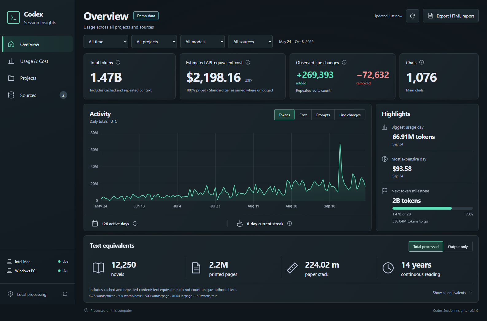

# Codex Session Insights

A small local dashboard for the wonderfully unreasonable amount of text you put through Codex. Tokens, API-equivalent cost, observed edits, project activity—and how many novels all that context would fill.



## Get the app

Download the latest assets from [Releases](https://github.com/c0gen/codex-session-insights/releases/latest).

- **Windows x64 dashboard:** unzip the whole folder and run `CodexSessionInsights.exe`. Windows 10/11, Microsoft Edge WebView2 Runtime and .NET Framework 4.8 are required. No Python or Node installation is needed. Builds are currently unsigned.
- **Intel Mac exporter:** macOS 12 or later. Unzip and open `Codex Insights Exporter.app`, index your sessions, then export usage. The app is currently unsigned and not notarized; use Finder’s Open action if macOS asks you to review it. The Python CLI is also available for Macs.

The app reads `$CODEX_HOME/sessions` and `archived_sessions`, or `~/.codex` when `CODEX_HOME` is unset. Add USB drives or other session directories in **Sources**. All analysis runs locally; there are no accounts, API keys, telemetry, or model calls.

## Usage from another computer

1. Open the exporter on that computer and give it a recognizable computer label in Settings.
2. Export a `.codex-insights` snapshot to a USB drive or shared folder.
3. Import it in the Windows dashboard.
4. Later exports replace the previous snapshot from the same exporter. Reimporting the same or an older revision is a no-op.

Each snapshot is a complete compressed set of usage facts, including timestamps, model settings, counters, project labels, session IDs and hashed edit identities. It contains no conversation text, commands, patch contents, or absolute file paths. Project/repository labels still identify your work: treat snapshots as private. Exported HTML reports anonymize project and source names by default.

Copied sessions count once. A verified longer prefix replaces a shorter copy. Divergent copies retain one accepted history and show a coverage diagnostic. An unplugged drive retains its indexed contribution. “Forget indexed history” removes that source’s contribution without changing the original sessions.

## What the numbers mean

- **Total tokens:** provider-reported usage after response-counter and verified copied-history reconciliation. Repeated context and cached input still count.
- **API-equivalent cost:** a token-price estimate in USD, using historical model rates and observed service tiers. Unlogged tiers assume Standard unless you set a Fast share. Unknown models remain unpriced and reduce the displayed coverage. It is not a subscription bill and excludes non-token tool/service charges.
- **Observed lines:** confirmed patch additions/removals visible in logs. Repeated edits count; shell writes and missing results produce partial coverage. This is not the final Git diff or a productivity score.
- **Main chats:** distinct main chat IDs with recorded activity in the selected range. Agents have their own usage breakdown.
- **Text equivalents:** deliberately playful approximations. Total processed includes repeated context; output includes reasoning/tool output. Formulas and both bases are visible in the dashboard.

Useful views are daily activity, model usage, token composition, prompt timing, and a project table. No quality score, inferred success rate, personality analysis, environmental estimate, or made-up time saved. See [metric review](docs/metrics.md) and [app specification](docs/spec.md).

## Local storage and live updates

Windows stores the index in `%LOCALAPPDATA%/Codex Session Insights`; macOS uses `~/Library/Application Support/Codex Session Insights`. The local SQLite index includes source paths and parser checkpoints. Accepted snapshots are backed up under `imports/`. Original session files are read-only.

The first scan can take several minutes for a large history. Later scans read appended complete lines. Filesystem notifications trigger refreshes, with a 30-second fallback scan for removable/network drives. Watching stops when the app closes. Refresh, Cancel and Rebuild index are available in the UI. Timezone and pricing changes recalculate the projection from stored facts.

## Develop or use the CLI

Python 3.11+ and Node.js 22+:

```powershell
python -m venv .venv
.venv\Scripts\python -m pip install -e ".[dev]"
cd frontend
npm ci
npm run build
cd ..
.venv\Scripts\python -m codex_insights --demo gui
```

On macOS/Linux, use `.venv/bin/python` instead. The synthetic demo is isolated in a separate data directory. `serve` opens a localhost server for UI development; the desktop window wraps those same assets.

```text
codex-insights scan --root /path/to/sessions
codex-insights export --output usage.codex-insights --label "Intel Mac"
codex-insights import usage.codex-insights
codex-insights report --output report.html
codex-insights --data-dir /path/to/index serve
codex-insights catalog
```

Global options (`--demo`, `--data-dir`) precede the command. Explicit scan roots add to existing indexed roots; on a fresh index they replace empty defaults. `report` exports the indexed data; scan first to update it. A JSON pricing catalog can be exported with `catalog` and edited/imported in Settings. Pricing tables are dated snapshots; no automatic network refresh occurs.

Run `python -m pytest -q`. Build Windows with `scripts/build_windows.ps1`; build an Intel Mac bundle using Python.org x86_64 Python and `python setup_mac.py py2app`. CI runs the accounting tests and builds both targets. Architecture and transfer format are documented in [docs/spec.md](docs/spec.md).

MIT licensed. Response-counter handling credits [TiboTattle](https://github.com/adamallcock/tibotattle); see [third-party notices](THIRD_PARTY_NOTICES.md).
